# CloudComputing-Project
Project made during the cloud Computing course at Insper

Pedro Altobelli

# Projeto:

## Escopo do Projeto:

Implementação de Arquitetura Cloud na AWS com Terraform
Objetivo: Provisionar uma arquitetura na AWS utilizando o Terraform, que engloba o uso de um Application Load Balancer (ALB), instâncias EC2 com Auto Scaling e um banco de dados RDS. Atenção: A escolha da região de implantação deve ser baseada em custos e desempenho, isso deve aparecer no seu relatório.

## Arquitetura do projeto

A arquitetura do projeto está representada na imagem a seguir:

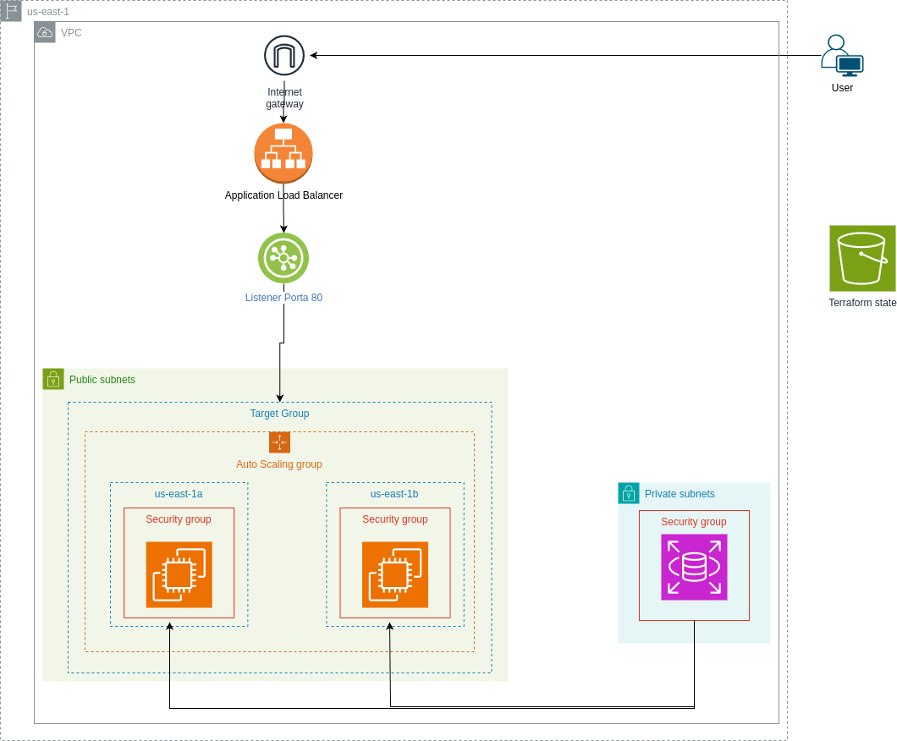

### VPC e ROUTE TABLE

Para a criação da nuvem onde será rodada a aplicação foi criada a VPC (Virtual Private Cloud) main com cidr block 10.0.0.0/16 e 4 subnets, sendo duas públicas para o application Load Balancer e as instâncias e duas privadas para o banco RDS. Nas subnets tanto públicas quanto privadas, uma delas esta na regiao us-east-1a e a outra na região us-east-1b. Colocar subnets de duas ou mais zonas 'e um requerimento necessario para o load balancer e consequentemente, o rds tambem precisa estar disponivel nessas duas zonas.

Modulos do VPC e route table em [modulo VPC](https://github.com/pedroaltobelli23/CloudComputing-Project/tree/main/terraform/vpc) e [Modulo Route Table](https://github.com/pedroaltobelli23/CloudComputing-Project/tree/main/terraform/route)

Saída esperada da vpc no console aws

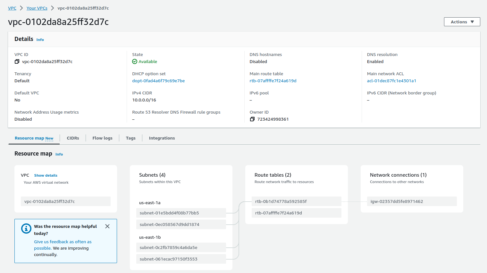

### SECURITY GROUP

Para as instâncias, ALB e RDS, foi configurado security groups.

O security group das instâncias permite entrada de tráfego nas portas 22 (para realizacao de SSH) e 80 (para o protocolo HTTP) para qualquer IP da VPC, na porta 8000 (Porta onde Applicao Django sera rodada) para IPs das subnets do ALB e na porta 3306 (porta padrao do Mysql) para o RDB. Permite saída de tráfego para qualquer IP da VPC.

O security group do ALB permite a entrada de tráfego nas portas 8000 e 80 para qualquer IP da VPC. Permite saída de tráfego para qualquer IP da VPC.

O security group do ALB permite a entrada de tráfego nas porta 3306 para qualquer IP nas subnets das instâncias. Permite saída de tráfego para qualquer IP da VPC.

Modulo do security group em [modulo SG](https://github.com/pedroaltobelli23/CloudComputing-Project/tree/main/terraform/sg)

Saída esperada do sg das instancias no console aws

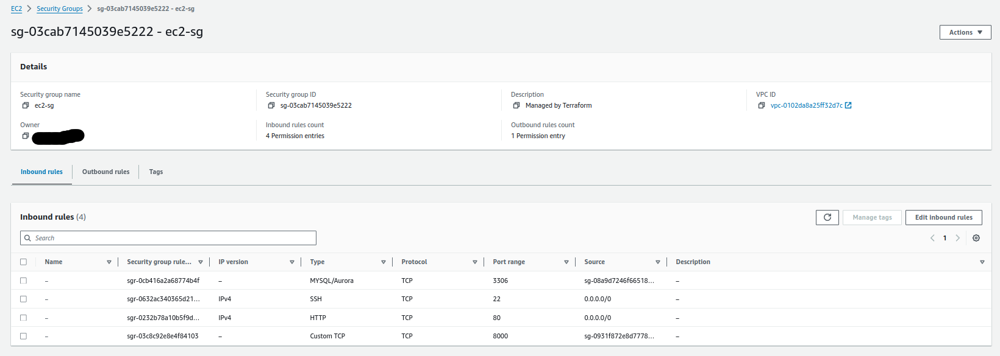

Saída esperada do sg do Load Balancer no console aws

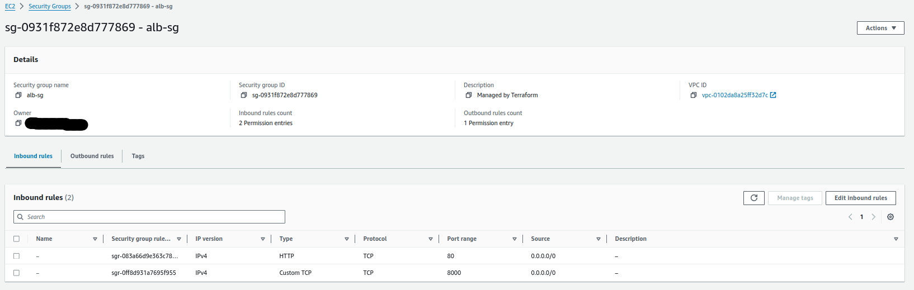

Saída esperada do sg do RDS no console aws

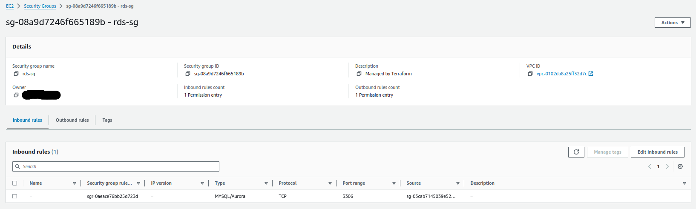

### AUTO SCALING GROUP

O Auto scaling group cria várias instâncias do EC2 nas subnets públicas. No projeto, essas instâncias criadas por esse recurso são mandadas imediatamente para um target group onde será distribuído o tráfego recebido pelo load balancer. Foi configurado que será criado uma instância nova nesse grupo quando a média de utilização de cpu chegar a 40%. Foi definido um máximo de 3 instâncias que podem ser criadas pelo ASG, porém é possível definir mais.

Para o autoscaling group foi utilizado uma [imagem IAM pronta](https://bitnami.com/stack/django) que instala python, Django e a versão 8.0 do mysql. Além disso,é rodado um script .sh que inicializa a [aplicação Django](https://github.com/pedroaltobelli23/CloudComputing-Application) e faz conexao com o banco de dados.

Modulo do autoscaling group em [modulo ASG](https://github.com/pedroaltobelli23/CloudComputing-Project/tree/main/terraform/asg)

Saída esperada do asg no console aws

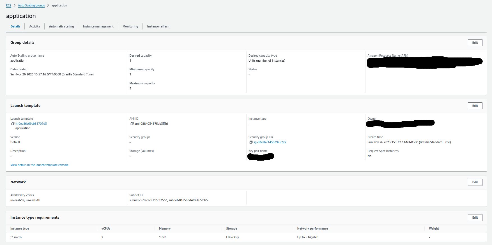

Saída esperada do CloudWatch no console aws

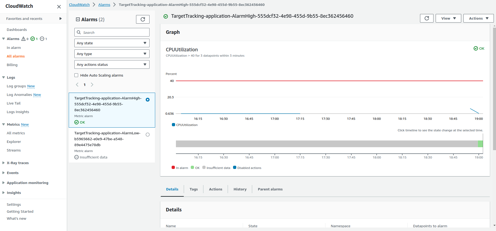

> IMPORTANTE: 
> Para testar o autoscaling group criando outras instancias automaticamente quando o cloudwatch 'e ativado, acesse [modulo ASG](https://github.com/pedroaltobelli23/CloudComputing-Project/tree/main/terraform/asg) e descomente aws_autoscaling_policy averagenetworkin

### APPLICATION LOAD BALANCER

O aplicativo load balancer tem a função de dividir o tráfego entre as instâncias do target group para aumentar a disponibilidade da aplicação. Para isso utiliza um listener na porta 80 que verifica as solicitações de conexão de clientes e roteia para uma instância disponível.

Modulo do Application Load Balancer em [modulo ALB](https://github.com/pedroaltobelli23/CloudComputing-Project/tree/main/terraform/alb)

Saída esperada do ALB no console aws

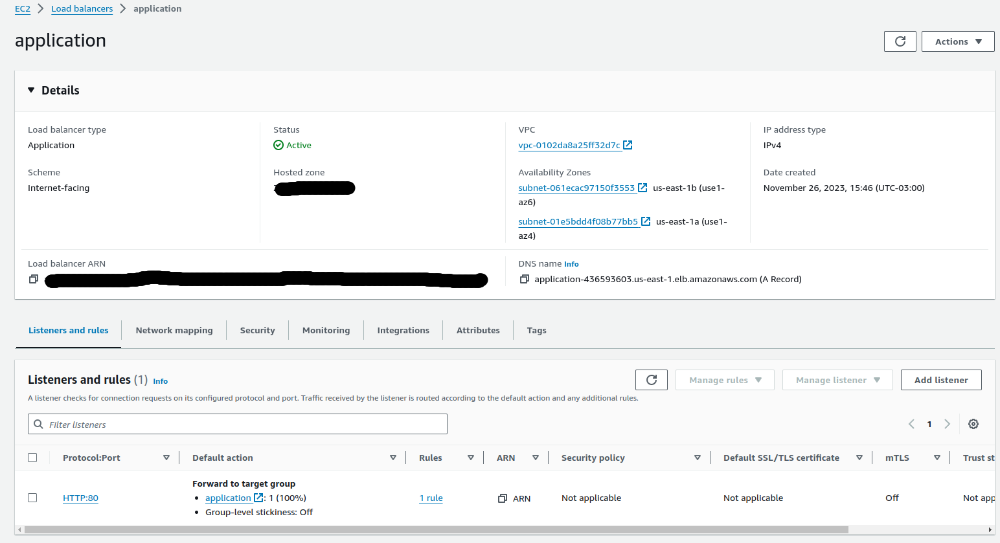

### RELATIONAL DATABASE

Banco de dados RDS em mysql 8.0 que é utilizado pela a aplicação para realizar operações CRUD. Foi definido para que somente as instâncias do autoscaling group tenham acesso a ele e foi criado nas subnets privadas.

Modulo do Relational Database em [modulo RDS](https://github.com/pedroaltobelli23/CloudComputing-Project/tree/main/terraform/rds)

Saída esperada do rds no console aws 

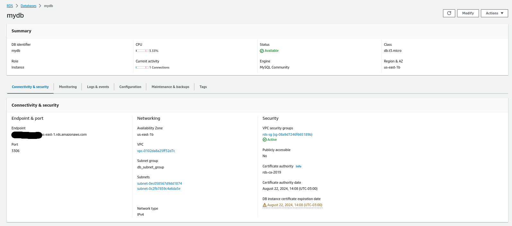

### S3 BUCKET

Utilizado para armazenar o estado do terraform para que o estado nao fique armazenado localmente na máquina de quem aplicou o apply do terraform, e sim remotamente para que todos os usuarios da conta na regiao us-east-1 possam ter acesso.

Modulo do S3Bucket em [modulo S3](https://github.com/pedroaltobelli23/CloudComputing-Project/tree/main/terraform/s3)

Saída esperada do s3 no console aws 

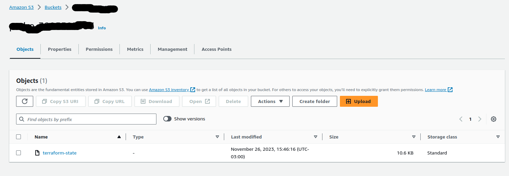

## Como rodar o projeto

- Instalar [AWS CLI](https://docs.aws.amazon.com/cli/latest/userguide/getting-started-install.html) e [Terraform](https://developer.hashicorp.com/terraform/tutorials/aws-get-started/install-cli)

- utilizar o comando `aws configure` para configurar usuário e senha da aws

- criar um keypair.pem no console da aws e armazenar na pasta terraform

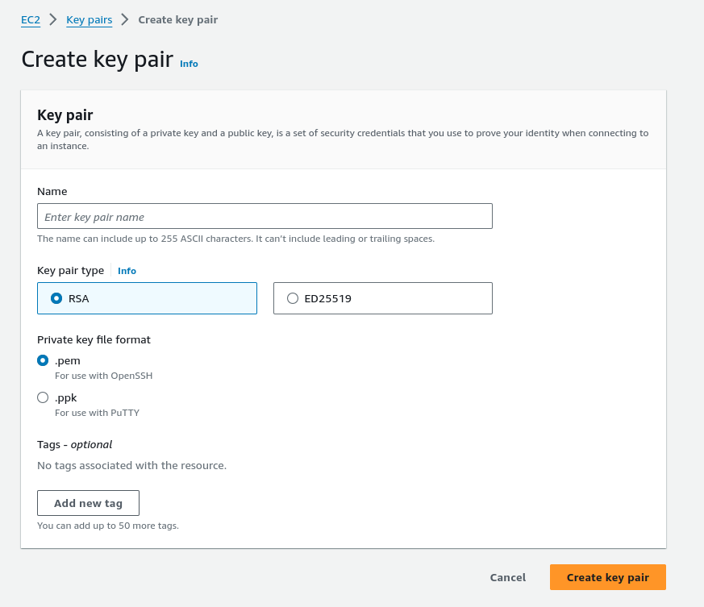

- `cd terraform && ./init.sh`

- Completar os campos de nome do usuário (nome do usuario mysql), senha (nova senha para o usuário do mysql no banco de dados), nome do database (database do banco de dados) e nome do keypair (dar o nome do keypair sem .pem).

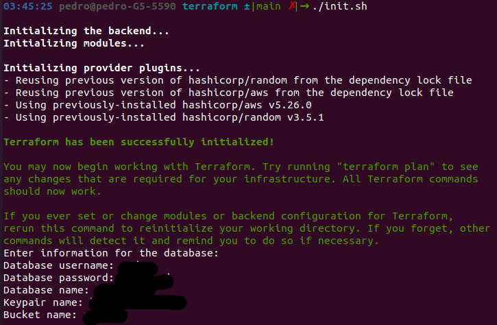

- Confirme as ações com "yes"

- Infraestrutura leva em torno de 15 minutos para realizar o deploy. Output esperado:

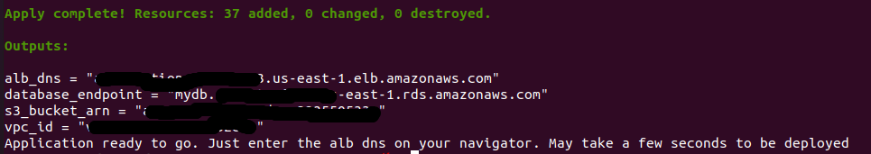

- Coloque o dns do load balancer no navegador. Caso a aplicacao nao apareça quando carregar a página, aguarde alguns segundos.

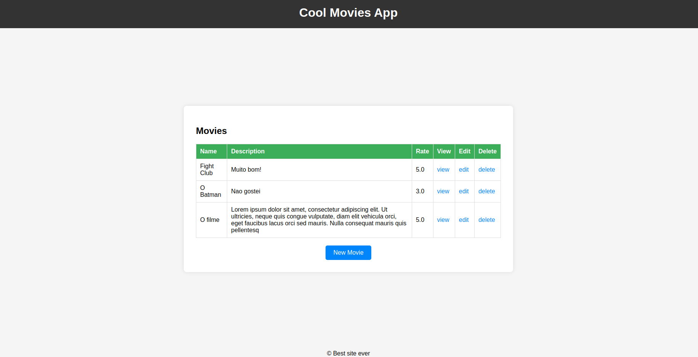

## Calculadora AWS

Supondo que a pagina tenha 10.000 visitas por mes, e cada pagina tem em torno de 500 kB e ha uma media de 5 vizualizacoes de pagina por visita, por mes tera 23.84 Gb por mes. Como ha duas regioes da AWS que sao utilizadas, conclui-se no pior dos casos uma transferencia de quase a totalidade dos dados de uma para a outra. Para fim de simplicidade determinei que a transferencia de dados entre regiao seria a mesma da transferencia de dados com a internet.Essa transferencia foi estimada na VPC, no ALB e nas instancias. Por hora, a media de transferencia de dados 'e de 0.0333 Gb. Como o autoscaling group possui um maximo de 3 instancias, irei calcular o preco para 3 instancias.O Preco do S3 Bucket 'e muito baixo, porem nao foi colocado em consideracao.

Considerando tambem que cada visita na aplicacao web faria o post duas vezes no banco rds e cada linha da tabela teria em media 100 bytes, podemos supor que o banco de dados teria 20000 linhas em MySQL, equivalente a 24 Mb. Portanto, uma db.m1.small de 1.7 Gb consegue dar conta dos dados

Preco do VPC:

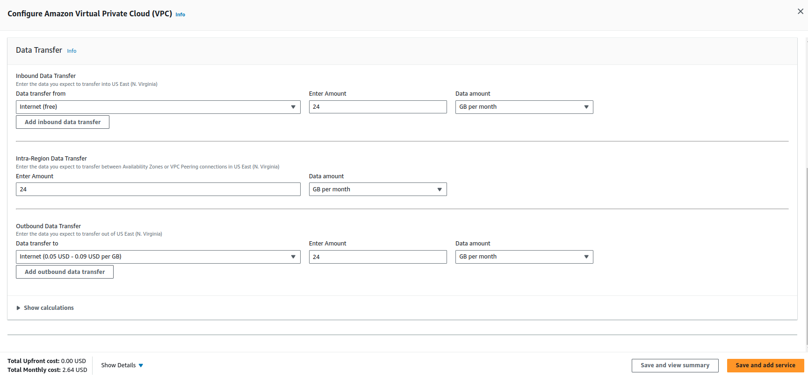

Preco do ALB:

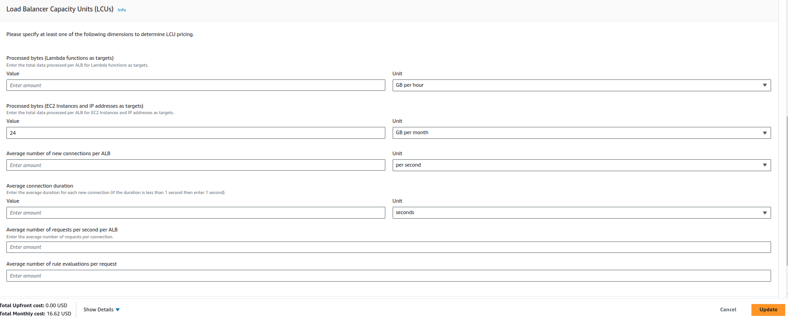

Preco das instancias:

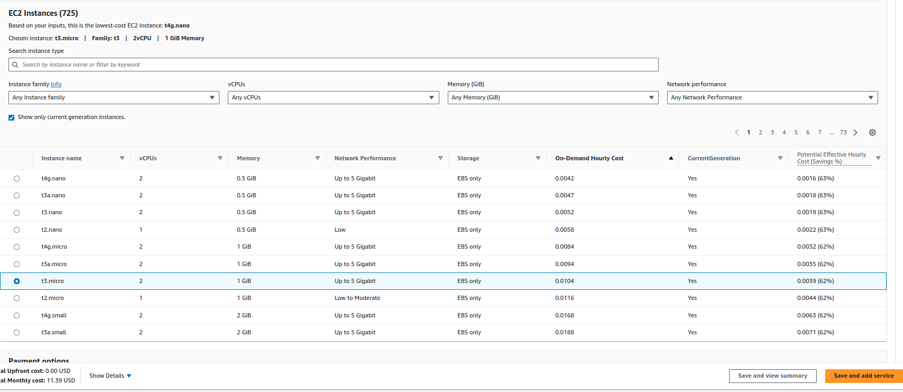

Preco do RDS:

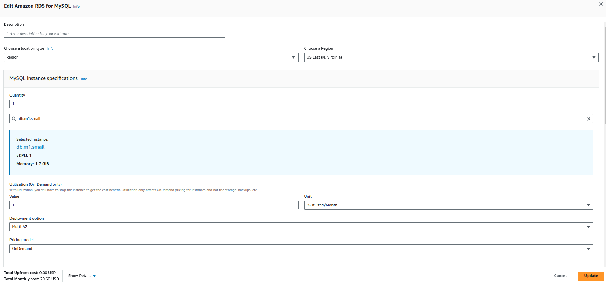

Preco total:

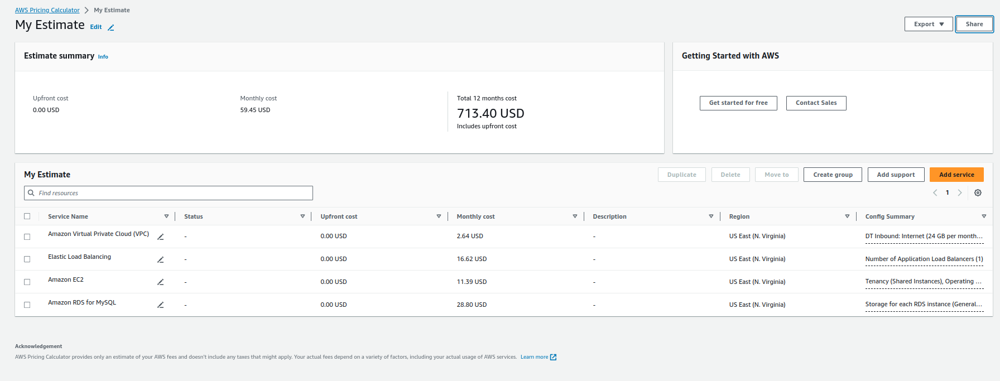

O relatorio da aws se encontra neste [link](https://github.com/pedroaltobelli23/CloudComputing-Project/tree/main/imgs/MyEstimateAWSPricingCalculator.pdf).
